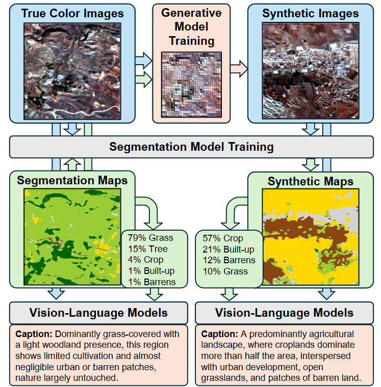
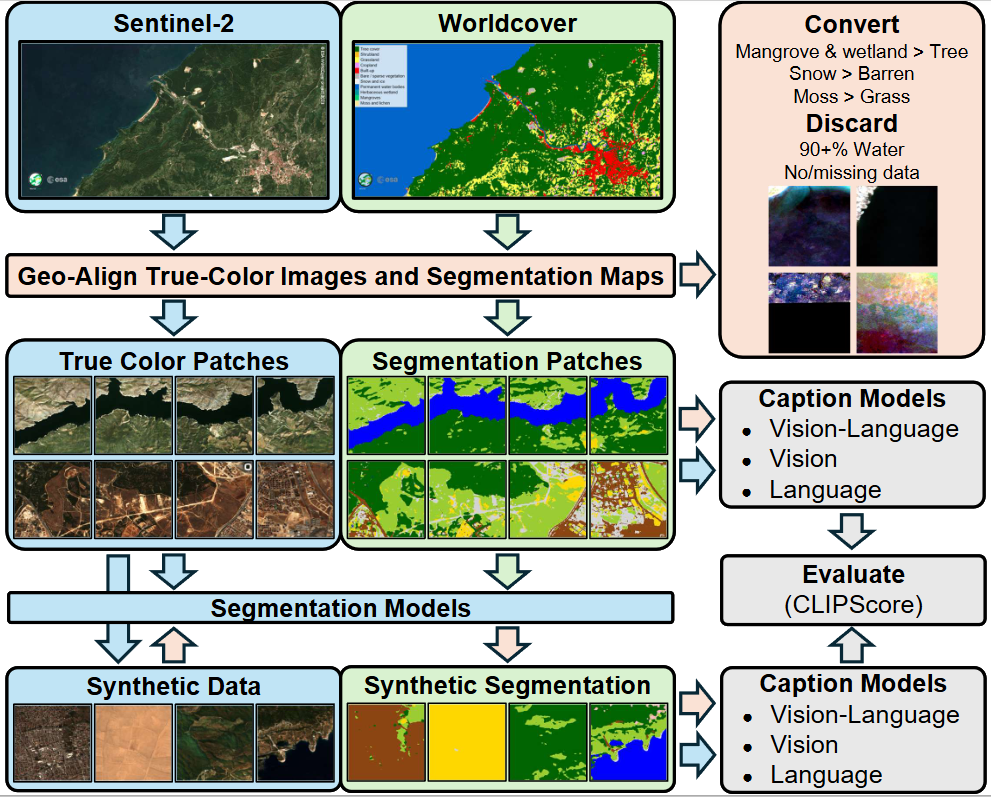

# ARAS400k



# Grounding Synthetic Data Generation With Vision and Language Models

This repository contains the complete pipeline for generating, processing, and evaluating the ARAS400k dataset. The workflow is designed to build a large-scale remote sensing dataset by extracting real satellite imagery, generating synthetic counterparts, producing multimodal captions, and training semantic segmentation models to evaluate the feature distributions of the resulting 400,000-image dataset (100,000 real / 300,000 synthetic). The dataset is available [here](https://zenodo.org/records/18890661).

After downloading check the md5 checksum table to determine if any file is missing or corrupt
train.zip: `95cd5caea68c813fd86888f9cd95b627`
val.zip: `76e61fd7557d65ba0596e44c0f92b43f`
test.zip: `01679231ee8e38701f5d3ab7de0b5719`
synth.zip: `0dc95bfdda44a816ade0d7ea747e4f9c`


## Docker Environments for Reproducibility

To ensure a stable and reproducible environment across different stages of the pipeline, the following Docker images are recommended:

* **Segmentation Model Training & Inference:** `mertcaglar/segm`
* **Caption Generation (Hugging Face Transformers):** `huggingface/transformers-pytorch-gpu`
* **Generative Model Training & Inference:** `mertcaglar/stylegan3`

---

## Pipeline Overview



### 1. Data Acquisition

**Script:** `dataset_downloader.py`

This script automates the retrieval of raw satellite data from the Terrascope platform.

* **Input:** Bounding box coordinates.
* **Process:** Queries and downloads Sentinel-2 RGBNIR (10m resolution) and ESA WorldCover 2021 classification maps.
* **Output:** Large `.tif` files stored in respective directories (`S2RGB_2021`, `worldcover_2021`).

### 2. Dataset Processing & Patch Creation

**Script:** `dataset_creator.py`

Processes the massive raw `.tif` files into training-ready image-mask pairs.

* **Process:** * Slices the imagery into 256x256 patches.
* Remaps specific WorldCover classes (e.g., Wetland and Moss to Grassland, Mangrove to Tree cover) to streamline the segmentation task.
* Applies strict filtering: discards patches containing "No Data" pixels or patches that are >90% water.


* **Output:** Paired RGB images (`images/`) and color-mapped segmentation masks (`masks/`) in `.png` format.

### 3. Synthetic Data Generation

This stage scales the dataset using generative adversarial networks to produce synthetic imagery.

* **Conditional Generation:** Utilizing a U-Net SPADE GAN architecture (`generative_trainer_unet_spade_gan`) to generate images conditioned on specific layout masks.
* **Unconditional Generation:** Leveraging StyleGAN3. You can initiate the training for the unconditional generation with the following command (optimized to utilize a 24GB VRAM GPU like the RTX 4090):
```bash
python stylegan3/train.py --outdir="out/ARAS400k" --cfg=stylegan2 --data="ARAS400k/train/images" --gpus=1 --batch=256 --gamma=0.01 --mirror=1 --aug="ada" --kimg 5000 --snap 200 --cbase 16384 --workers 16

```


### 4. Multimodal Image Captioning

The repository includes several distinct approaches to generating descriptive captions for the dataset, allowing for robust metadata creation based on vision, text, or a fusion of both.

* **Vision-Language Fusion (`vision_language_captioner.py`):** The primary captioner. It uses `Qwen3-VL-8B-Instruct` to analyze both the visual features of the image and the explicitly provided land-cover class percentages (via CSV) to generate highly accurate, layout-aware descriptions.
* **Vision-Only (`vision_captioner.py`):** Uses `gemma-3-4b-it` to generate captions relying strictly on the visual information present in the `.png` files.
* **Text-Only (`text_captioner.py`):** Uses `Qwen3-4B-Instruct` to generate descriptive natural language captions based *solely* on the numerical land-cover percentages provided in a CSV, without looking at the image.

**Alternative / Local Captioning Options:**

* **`gpt_captioner.py`:** A scalable script utilizing the OpenAI Batch API (`gpt-4-mini`) to aggressively process hundreds of thousands of percentage-based text prompts at a lower cost.
* **`ollama_captioner.py`:** A fully localized, offline solution using Ollama. Supports both vision-based captioning (via `moondream`) and text-based description generation (via `gemma3:4b-it-qat`).

### 5. Semantic Segmentation Training

**Script:** `segmentation_train.py`

Trains a deep learning model to evaluate and parse the remote sensing imagery.

* **Architecture:** Segformer with an `segformer with efficientnet-b7` encoder, powered by `segmentation_models_pytorch`.
* **Features:** Integrates Heavy Albumentations augmentations (flips, rotations, brightness/contrast adjustments), multiclass Dice Loss, and ReduceLROnPlateau scheduling.
* **Tracking:** Fully integrated with Weights & Biases (WandB) for logging loss, macro F1, precision, recall, and per-class IoU.
* **Output:** Saves the best model weights and generates zipped visual predictions on the test set.

### 6. Feature Distribution Visualization

**Script:** `segformer_vis.py`

Validates the quality of the synthetic data by comparing its feature distribution against the real data.

* **Process:** Loads the trained `efficientnet-b7` encoder from the segmentation step to extract high-level bottleneck features from a subset of Real, Synthetic, and Generated images.
* **Output:** Generates and saves 2D projection plots using both t-SNE and UMAP algorithms. It also computes overall and pairwise Silhouette scores to quantitatively measure how well the distributions align.

---
